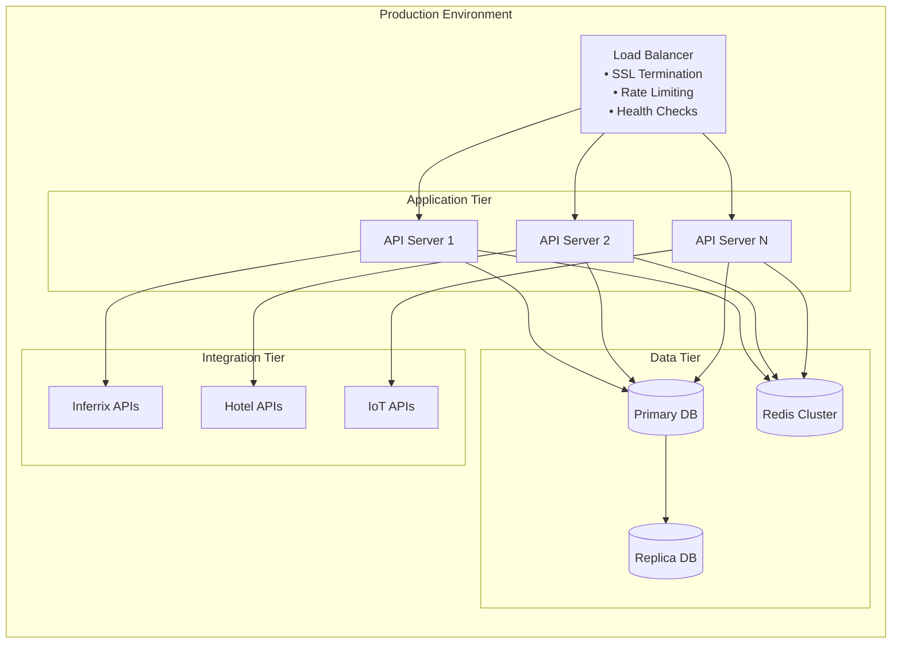

# 🏗️ Inferrix Agentic AI Platform - Architecture Diagram

## System Architecture Overview

```mermaid
graph TB
    subgraph "User Layer"
        U1[Hotel Manager]
        U2[Building Engineer]
        U3[Facility Operator]
        U4[Guest (Mobile App)]
    end

    subgraph "Presentation Layer"
        FE[React Frontend<br/>• Modern UI/UX<br/>• Device Context<br/>• Real-time Updates<br/>• Responsive Design]
    end

    subgraph "Application Layer"
        BE[FastAPI Backend<br/>• RESTful APIs<br/>• JWT Authentication<br/>• Rate Limiting<br/>• Error Handling]
        
        subgraph "Agentic AI Engine"
            AGENT[GPT-4o LLM<br/>• Natural Language Understanding<br/>• Dynamic Function Selection<br/>• Context Management<br/>• Tool Calling]
            
            TOOLS[Function Router<br/>• API Selection<br/>• Parameter Extraction<br/>• Execution Orchestration<br/>• Response Formatting]
        end
    end

    subgraph "Integration Layer"
        INFERRIX[Inferrix Cloud APIs<br/>• Device Management<br/>• Telemetry Data<br/>• Alarm Systems<br/>• Control Commands]
        
        HOTELAPI[Hotel Digital Twin APIs<br/>• Room Management<br/>• Guest Experience<br/>• Energy Optimization<br/>• Maintenance Scheduling]
        
        IOT[IoT Device APIs<br/>• Sensors<br/>• Controllers<br/>• Actuators<br/>• Gateways]
    end

    subgraph "Data Layer"
        DB[(PostgreSQL Database<br/>• User Management<br/>• Session Storage<br/>• Audit Logs<br/>• Configuration)]
        
        CACHE[(Redis Cache<br/>• Session Data<br/>• API Responses<br/>• Rate Limiting<br/>• Performance)]
    end

    subgraph "Security Layer"
        SEC[Security Middleware<br/>• JWT Validation<br/>• CORS Protection<br/>• Input Sanitization<br/>• DDoS Protection]
    end

    %% Connections
    U1 --> FE
    U2 --> FE
    U3 --> FE
    U4 --> FE
    
    FE -->|HTTPS/JWT| BE
    BE -->|All Requests| SEC
    SEC -->|Protected| BE
    
    BE -->|/chat| AGENT
    AGENT -->|Function Calls| TOOLS
    TOOLS -->|API Calls| INFERRIX
    TOOLS -->|API Calls| HOTELAPI
    TOOLS -->|API Calls| IOT
    
    BE -->|User Data| DB
    BE -->|Cache| CACHE
    
    %% Styling
    classDef userLayer fill:#e1f5fe,stroke:#01579b,stroke-width:2px
    classDef presentationLayer fill:#f3e5f5,stroke:#4a148c,stroke-width:2px
    classDef applicationLayer fill:#e8f5e8,stroke:#1b5e20,stroke-width:2px
    classDef integrationLayer fill:#fff3e0,stroke:#e65100,stroke-width:2px
    classDef dataLayer fill:#fce4ec,stroke:#880e4f,stroke-width:2px
    classDef securityLayer fill:#f1f8e9,stroke:#33691e,stroke-width:2px
    
    class U1,U2,U3,U4 userLayer
    class FE presentationLayer
    class BE,AGENT,TOOLS applicationLayer
    class INFERRIX,HOTELAPI,IOT integrationLayer
    class DB,CACHE dataLayer
    class SEC securityLayer
```

## Key Architecture Features

### 🧠 **Agentic AI Engine**
- **GPT-4o LLM**: State-of-the-art language model for natural language understanding
- **Dynamic Function Calling**: Automatically selects and executes the right API functions
- **Context Awareness**: Maintains conversation context and device selection
- **Tool Router**: Intelligent routing to appropriate APIs based on query intent

### 🔒 **Security Architecture**
- **JWT Authentication**: Secure token-based user authentication
- **Rate Limiting**: Protection against API abuse and DDoS attacks
- **Input Validation**: Comprehensive sanitization of all user inputs
- **CORS Protection**: Configurable cross-origin resource sharing
- **Audit Logging**: Complete trail of all system activities

### ⚡ **Performance & Scalability**
- **Multi-tenant Design**: Support for multiple customers on single platform
- **Horizontal Scaling**: Easy scaling across multiple server instances
- **Caching Layer**: Redis-based caching for improved performance
- **Connection Pooling**: Efficient database connection management
- **Load Balancing**: Ready for production load balancer deployment

### 🔌 **Integration Capabilities**
- **RESTful APIs**: Standard HTTP-based integration with any system
- **Real-time Data**: Live device telemetry, alarms, and control
- **Extensible Design**: Easy addition of new APIs and data sources
- **Error Handling**: Graceful degradation and comprehensive error management

## Technology Stack

| Layer | Technology | Purpose |
|-------|------------|---------|
| **Frontend** | React + Tailwind CSS | Modern, responsive user interface |
| **Backend** | FastAPI (Python) | High-performance API framework |
| **AI Engine** | OpenAI GPT-4o + LangChain | Natural language processing and function calling |
| **Database** | PostgreSQL | Reliable relational database |
| **Cache** | Redis | High-performance caching and session storage |
| **Security** | JWT + Custom Middleware | Authentication and security controls |
| **Deployment** | Docker + Cloud Native | Scalable, containerized deployment |

## Deployment Architecture



## Security & Compliance

### 🔐 **Security Features**
- **Authentication**: JWT-based secure authentication
- **Authorization**: Role-based access control (RBAC)
- **Data Encryption**: TLS 1.3 for data in transit
- **Input Validation**: Comprehensive sanitization and validation
- **Rate Limiting**: Protection against abuse and attacks
- **Audit Logging**: Complete activity trail for compliance

### 📋 **Compliance Ready**
- **GDPR**: Data privacy and user consent management
- **SOC 2**: Security controls and audit trails
- **ISO 27001**: Information security management
- **HIPAA**: Healthcare data protection (for healthcare deployments)

## Scalability & Performance

### 📈 **Scalability Metrics**
- **Horizontal Scaling**: Add servers to handle increased load
- **Database Scaling**: Read replicas and connection pooling
- **Caching Strategy**: Multi-level caching for optimal performance
- **CDN Integration**: Global content delivery for frontend assets

### ⚡ **Performance Targets**
- **Response Time**: < 2 seconds for AI queries
- **Uptime**: 99.9% availability
- **Throughput**: 1000+ concurrent users
- **API Success Rate**: 94.3% (with graceful error handling)

---

*This architecture supports enterprise-grade deployments with full scalability, security, and performance optimization.* 